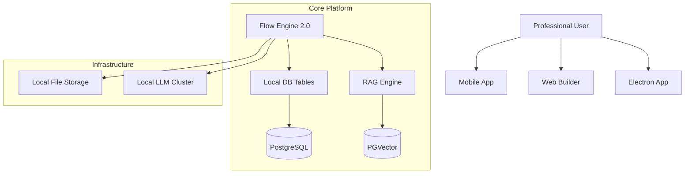

# План дальнейшей разработки: Phase 5 - Intelligence & Ecosystem Expansion

Этот план описывает шаги по трансформации ConstructorAI из генератора материалов в полноценную **операционную систему для AI-приложений**, работающую полностью автономно (Sovereign AI).

## 1. Глубокий Интеллект (Deep Intelligence)
Цель: Превратить платформу в базу знаний, которая "учится" на документах пользователя.

- **Внедрение RAG (Retrieval-Augmented Generation)**:
    - Интеграция расширения `pgvector` в PostgreSQL для хранения эмбеддингов.
    - Реализация модуля индексации документов (PDF, TXT, MD) в `[backend/src/services/ai.service.ts](backend/src/services/ai.service.ts)`.
    - Добавление ноды "Knowledge Search" в конструктор флоу.
- **Интерфейс "Обучения"**:
    - Загрузчик документов с автоматической нарезкой на чанки (chunking) и генерацией векторов через локальные модели.

## 2. Low-Code Логика и Базы Данных (App Builder)
Цель: Позволить создавать приложения со сложной логикой и хранением данных.

- **Расширенный AI Flow Builder**:
    - Добавление поддержки переменных окружения флоу, условий (If/Else) и циклов.
    - Интеграция триггеров: Webhooks (входящие), расписание, события UI.
- **Модуль "Локальные Таблицы"**:
    - Визуальный редактор схем данных. Пользователи могут создавать свои таблицы внутри проекта.
    - CRUD-ноды во флоу-билдере для работы с этими таблицами.

## 3. Профессиональный Инструментарий (Professional Suite)
Цель: Повышение продуктивности дизайнеров и разработчиков.

- **Global Design Tokens**:
    - Система единых стилей (переменных) для всего проекта: цвета, отступы, типографика. Изменение одного токена обновляет все блоки и страницы.
- **Версионирование в стиле Git**:
    - Возможность создавать ветки (Branches), делать коммиты изменений и переключаться между ними. Реализация через новую таблицу `ProjectVersion` в Prisma.
- **Shared Components Library**:
    - Возможность публиковать свои компоненты в "корпоративный маркетплейс" для переиспользования в других проектах внутри организации.

## 4. Корпоративный Слой (Enterprise & Ops)
Цель: Подготовка платформы к использованию в крупных организациях.

- **Multi-tenancy & Organizations**:
    - Группировка пользователей в организации с изолированными ресурсами.
- **Audit Logs**:
    - Система тотального логирования действий AI и административных изменений для соответствия стандартам безопасности.
- **Advanced RBAC**:
    - Кастомные роли (например, "Только AI-редактор" или "Контент-менеджер без доступа к настройкам моделей").

## 5. Расширение Присутствия (Platform Expansion)
Цель: Доступность на всех устройствах и максимальная производительность.

- **Мобильный Редактор (Touch-first)**:
    - Полноценная адаптация конструктора под планшеты и смартфоны. Упрощенный интерфейс редактирования контента "на ходу".
- **Десктопное Приложение (Electron)**:
    - Нативная сборка для Windows/macOS/Linux.
    - Преимущества: прямой доступ к файловой системе, локальное кэширование моделей, работа в оффлайн-режиме без браузерных ограничений.

---

## Архитектура Будущего (v5.0)

